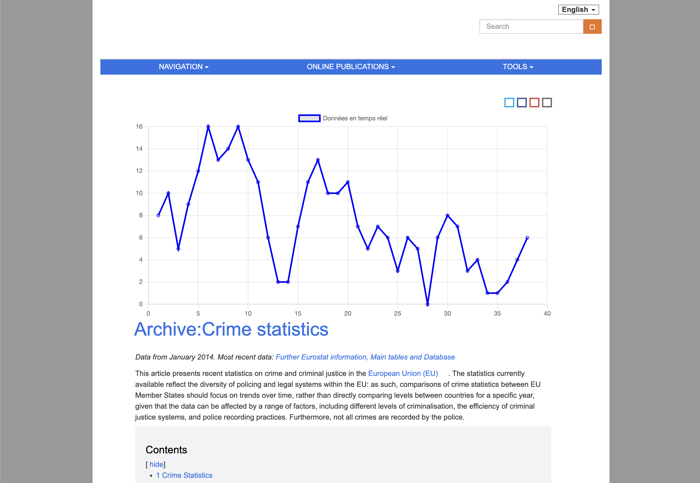

# 📈 JS DATA VISUALISATION CHALLENGE

## 🔗 LIENS PROJET

- **Projet en ligne :** [https://evalambert.github.io/js-datavisualisation-challenge/](https://evalambert.github.io/js-datavisualisation-challenge/ "lien projet js-datavisualisation-challenge en ligne")

## 📌 FICHE PROJET

- **Contexte :** Formation "Junior Developer" BeCode
- **Type :** Challenge consolidation
- **Durée :** 5 jours
- **Deadline :** 08/10/23 -- 05:00 p.m.
- **Équipe :** Solo

## 🎯 OBJECTIFS

L'objectif de ce challenge est de consolider nos bases en javascript

- Manipulation du DOM
- Requête AJAX / FETCH
- Utilisation de la bibliothèque Chart.js
- résolution de problèmes : concevoir une solution logique pour mettre en œuvre le résultat attendu
- Débogage à l'aide de la console
- Comprendre la notion de « séparation des préoccupations »

## 🌐 TECHNO & LANGUAGES UTILISÉS

- Vite.js
- Pnpm
- ESlint
- Prettier
- Javascript
- Chart.js

## ⏰ ÉTAT D'AVANCEMENT

Terminé 🍎

## 👀 APERÇU DU PROJET

